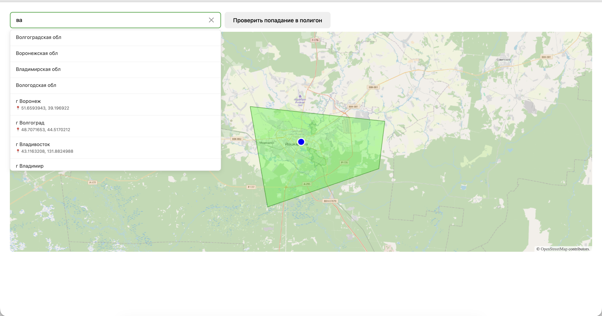

# 🗺️ Карта с полигонами и автокомплитом адресов

Интерактивное веб-приложение для работы с картами: рисование полигонов, поиск адресов и проверка попадания точек в полигоны.

ссылка на проект https://maps-bwa.pages.dev/



## ✨ Основной функционал

### 🎨 Рисование полигонов

- Рисование произвольных полигонов на карте (3-20 вершин)
- Валидация самопересечений в реальном времени
- Визуальная индикация ошибок (красная подсветка при самопересечении)
- Удаление полигона двойным кликом с hover-эффектом

### 🔍 Поиск адресов

- Автокомплит адресов через DaData API
- Debounce для оптимизации запросов (200мс)
- Отображение координат в подсказках
- Loading и error states
- Очистка инпута одним кликом

### ✅ Проверка попадания

- Проверка попадания выбранного адреса в нарисованный полигон
- Toast-уведомления с результатом проверки
- Валидация наличия данных (адрес + полигон)

---

## 🛠️ Технологии

### Core

- **React 19 RC** - UI библиотека
- **TypeScript** - типизация
- **Vite** - сборщик и dev-сервер

### Карты

- **OpenLayers 10.7** - библиотека для работы с картами
- **OSM (OpenStreetMap)** - тайлы карты

### Валидация и API

- **Zod** - валидация переменных окружения
- **DaData API** - автокомплит адресов

### Архитектура

- **Context API** - управление состоянием toast-уведомлений
- **Custom Hooks** - переиспользуемая логика (`useToast`, `useClickOutside`, `useDebouncedCallback`)
- **CSS Modules** - изолированные стили

---

## 🚀 Установка и запуск

### Требования

- **Node.js** 20.19+ или 22.12+
- **pnpm** (или npm/yarn)

### Установка

1. **Клонируйте репозиторий**

```bash
git clone https://github.com/ilyuha13/maps.git
cd maps

2. Установите зависимости
pnpm install

3. Создайте файл .env
cp .env.example .env

4. Добавьте API ключ DaData

Откройте .env и вставьте ваш ключ:
VITE_DADATA_API_KEY=your_api_key_here

💡 Получить API ключ можно на https://dadata.ru/

Запуск

Development режим:
pnpm dev
Приложение откроется на http://localhost:5173

Production сборка:
pnpm build
pnpm preview

Линтинг:
pnpm lint

---
📁 Структура проекта

src/
├── components/           # React компоненты
│   ├── AddressAutocomplete/
        ├── AddressAutocomplete.tsx
        └── AddressAutocomplete.module.css
│   ├── MapComponents/
│   │   ├── MapComponents.tsx
│   │   └── MapComponents.module.css
│   └── Toast/           # Система уведомлений
│       ├── Toast.tsx
│       ├── ToastContainer.tsx
│       └── Toast.module.css
├── context/             # React Context
│   └── ToastContext.tsx
├── hooks/               # Custom hooks
│   ├── useToast.ts
│   ├── useClickOutside.ts
│   └── useDebouncedCallback.ts
├── helpers.ts           # Вспомогательные функции
├── types.ts             # TypeScript типы
├── env.ts               # Валидация переменных окружения
└── App.tsx              # Главный компонент

---
🎯 Особенности реализации

Архитектурные решения

1. Управление состоянием
- Context API для глобальных toast-уведомлений
- Refs для работы с OpenLayers (императивный API)
- Local state для UI компонентов

2. Валидация
- Zod схемы для переменных окружения
- Проверка самопересечений полигонов (собственная реализация)
- Валидация координат от API

3. Оптимизация
- Debounce для автокомплита
- useMemo/useCallback для стабильности функций
- CSS Modules для tree-shaking стилей

---
  🧪 Тестирование функционала

  Сценарий 1: Рисование полигона

  1. Кликните на карту для начала рисования
  2. Поставьте несколько точек (минимум 3, максимум 20)
  3. Попробуйте создать самопересечение - полигон станет красным
  4. Замкните полигон на первой точке

  Сценарий 2: Поиск адреса

  1. Введите адрес в поле "Начните вводить адрес..."
  2. Дождитесь подсказок (с индикатором загрузки)
  3. Выберите нужный адрес из списка
  4. Маркер появится на карте, карта центрируется

  Сценарий 3: Проверка попадания

  1. Нарисуйте полигон на карте
  2. Выберите адрес
  3. Нажмите "Проверить попадание в полигон"
  4. Увидите toast-уведомление с результатом

  Сценарий 4: Удаление полигона

  1. Наведите курсор на нарисованный полигон
  2. Полигон станет красным
  3. Сделайте двойной клик
  4. Полигон удалится, можно рисовать новый

 👨‍💻 Ilya Churshukov
```
